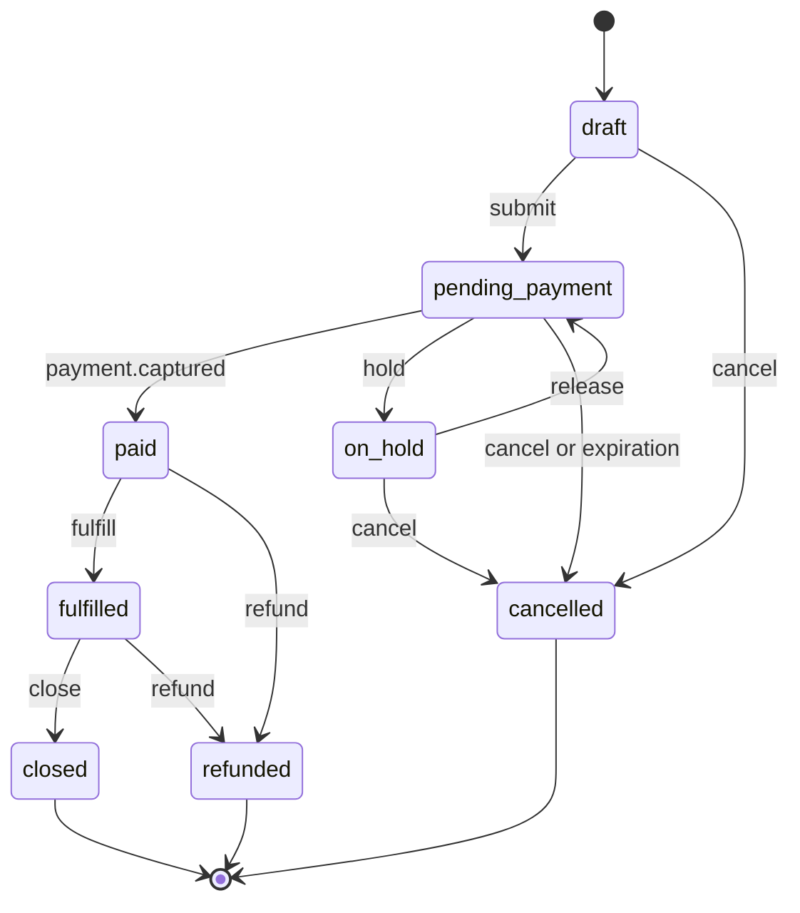

# Orders

The `order` resource is the central object of Orion Platform: it aggregates line items, links a customer to a payment, and defines the transaction lifecycle. Orders are handled by the `orion-core` component, and every status change publishes an event to the `orion.events.v1` topic. Amounts are expressed in cents as integers.

## Object model

| Field | Type | Required | Description |
| --- | --- | --- | --- |
| `id` | string | read only | an `ord_...` identifier |
| `customer` | string | yes | a `cus_...` identifier |
| `status` | string | read only | `draft`, `pending_payment`, `paid`, `on_hold`, `fulfilled`, `closed`, `cancelled`, `refunded` |
| `currency` | string | yes | `PLN`, `EUR`, `USD` |
| `items[]` | array | yes at `submit` | line items with `itm_...` identifiers |
| `amount_total` | integer | read only | sum of the line items in the smallest unit of the currency |
| `amount_paid` | integer | read only | amount captured by `orion-ledger` |
| `payment` | string | read only | the `pay_...` identifier of the related payment |
| `channel` | string | no | `web`, `mobile`, `marketplace`, `pos` |
| `metadata` | object | no | up to 20 custom keys |
| `expires_at` | string | read only | expiration while in the `pending_payment` status |
| `created_at` | string | read only | ISO-8601 UTC timestamp |

A line item contains `id` (`itm_...`), `sku`, `name`, `quantity`, `unit_amount`, `tax_rate`, and `metadata`.

```json title="Fragment of an order object"
{
  "id": "ord_01HQ8ZV3KXN4M2T9YB7C6D",
  "object": "order",
  "customer": "cus_01HQ8ZV3KXN4M2T9YB7C6D",
  "status": "pending_payment",
  "currency": "PLN",
  "items": [
    {
      "id": "itm_01HQ8ZV3KXN4M2T9YB7C7E",
      "sku": "OVEN-KM-200",
      "name": "KM-200 convection oven",
      "quantity": 1,
      "unit_amount": 1299000,
      "tax_rate": 23
    }
  ],
  "amount_total": 1299000,
  "amount_paid": 0,
  "payment": null,
  "channel": "web",
  "metadata": {"erp_id": "ORD/2026/04/118"},
  "expires_at": "2026-04-12T10:01:04Z",
  "created_at": "2026-04-12T09:31:04Z"
}
```

## Lifecycle



### Allowed transitions

| From | To | Triggered by | Event |
| --- | --- | --- | --- |
| `draft` | `pending_payment` | `POST /v1/orders/{id}/submit` | `order.created` |
| `draft` | `cancelled` | `POST /v1/orders/{id}/cancel` | `order.cancelled` |
| `pending_payment` | `paid` | payment capture | `order.paid` |
| `pending_payment` | `on_hold` | anti-fraud rule | — |
| `pending_payment` | `cancelled` | `cancel` or `orion-scheduler` | `order.cancelled` |
| `on_hold` | `pending_payment` | operator decision in the console | — |
| `paid` | `fulfilled` | `POST /v1/orders/{id}/fulfill` | `order.fulfilled` |
| `paid` | `refunded` | refund of the full amount | `payment.refunded` |
| `fulfilled` | `closed` | closing of the settlement period | — |
| `fulfilled` | `refunded` | refund of the full amount | `payment.refunded` |

Any transition not listed in the table fails with `ORN-4005`.

## Endpoints

### POST /v1/orders

Creates an order in the `draft` status. Requires the `orders:write` scope.

| Body field | Type | Required | Description |
| --- | --- | --- | --- |
| `customer` | string | yes | a `cus_...` identifier |
| `currency` | string | yes | `PLN`, `EUR`, `USD` |
| `items` | array | no | line items can be added later |
| `channel` | string | no | defaults to `web` |
| `metadata` | object | no | up to 20 keys |

=== "curl"

    ```bash
    curl -X POST https://api.orion.example.com/v1/orders \
      -H "X-Orion-Key: ok_live_9f2c41ab7d5e" \
      -H "Idempotency-Key: erp-ORD-2026-04-118" \
      -H "Content-Type: application/json" \
      -d '{"customer":"cus_01HQ8ZV3KXN4M2T9YB7C6D","currency":"PLN","channel":"web"}'
    ```

=== "Python"

    ```python
    order = client.orders.create(
        customer="cus_01HQ8ZV3KXN4M2T9YB7C6D",
        currency="PLN",
        channel="web",
        idempotency_key="erp-ORD-2026-04-118",
    )
    ```

=== "Java"

    ```java
    Order order = client.orders().create(
        OrderCreateParams.builder()
            .customer("cus_01HQ8ZV3KXN4M2T9YB7C6D")
            .currency("PLN")
            .channel("web")
            .build());
    ```

```json title="201 Created response"
{
  "id": "ord_01HQ8ZV3KXN4M2T9YB7C6D",
  "object": "order",
  "status": "draft",
  "currency": "PLN",
  "items": [],
  "amount_total": 0,
  "amount_paid": 0,
  "created_at": "2026-04-12T09:31:04Z"
}
```

Possible errors: `ORN-1001`, `ORN-1004`, `ORN-1007`, `ORN-2003`, `ORN-4002`, `ORN-3001`.

### GET /v1/orders/{id}

Returns an order. Requires the `orders:read` scope.

| Parameter | Type | Required | Description |
| --- | --- | --- | --- |
| `id` | path | yes | an `ord_...` identifier |
| `expand` | query | no | `customer`, `items`, `payment` |

Possible errors: `ORN-2001`, `ORN-2003`, `ORN-5002`.

### GET /v1/orders

A list of orders, sorted in descending order by `created_at` by default.

| Parameter | Type | Required | Description |
| --- | --- | --- | --- |
| `status` | query | no | a single status or `status[in]=paid,fulfilled` |
| `customer` | query | no | a `cus_...` identifier |
| `created_after` | query | no | ISO-8601 UTC timestamp |
| `channel` | query | no | `web`, `mobile`, `marketplace`, `pos` |
| `limit` | query | no | defaults to 25, max. 100 |

```bash title="Request"
curl "https://api.orion.example.com/v1/orders?status[in]=paid,fulfilled&limit=50" \
  -H "X-Orion-Key: ok_live_9f2c41ab7d5e"
```

Possible errors: `ORN-1012`, `ORN-3004`, `ORN-3001`.

### PATCH /v1/orders/{id}

Updates `channel`, `metadata`, and `currency` (the last one only while in the `draft` status).

Possible errors: `ORN-1007`, `ORN-4005` (an attempt to change the currency after `submit`), `ORN-2003`.

### POST /v1/orders/{id}/items

Adds a line item to an order in the `draft` status. At most 200 line items.

| Body field | Type | Required | Description |
| --- | --- | --- | --- |
| `sku` | string | yes | the merchant's product identifier |
| `name` | string | yes | name shown to the customer |
| `quantity` | integer | yes | ≥ 1 |
| `unit_amount` | integer | yes | unit price in cents |
| `tax_rate` | integer | no | rate in percent, defaults to 23 |

```json title="201 Created response"
{
  "id": "itm_01HQ8ZV3KXN4M2T9YB7C7E",
  "object": "order_item",
  "order": "ord_01HQ8ZV3KXN4M2T9YB7C6D",
  "sku": "OVEN-KM-200",
  "quantity": 1,
  "unit_amount": 1299000
}
```

Possible errors: `ORN-1004`, `ORN-4005` (the order is not in `draft`), `ORN-2003`.

### POST /v1/orders/{id}/submit

Submits the order: it recalculates `amount_total`, moves the status to `pending_payment`, sets `expires_at`, and publishes `order.created`. The request body is empty.

```json title="200 OK response"
{
  "id": "ord_01HQ8ZV3KXN4M2T9YB7C6D",
  "status": "pending_payment",
  "amount_total": 1299000,
  "expires_at": "2026-04-12T10:01:04Z"
}
```

Possible errors: `ORN-1004` (no line items), `ORN-4005`, `ORN-5009`.

### POST /v1/orders/{id}/cancel

Cancels an order in the `draft`, `pending_payment`, or `on_hold` status. The optional `reason` field (up to 200 characters) is carried into the `order.cancelled` event.

Possible errors: `ORN-4005`, `ORN-4008` (the order is already paid), `ORN-2003`.

### POST /v1/orders/{id}/fulfill

Marks the order as fulfilled. Requires the `paid` status.

| Body field | Type | Required | Description |
| --- | --- | --- | --- |
| `tracking_number` | string | no | shipment number |
| `carrier` | string | no | carrier name |
| `items` | array | no | `itm_...` identifiers for partial fulfillment |

Possible errors: `ORN-4005`, `ORN-1004`, `ORN-5002`.

## Order expiration

An order in the `pending_payment` status expires **30 minutes** after `submit`. Expiration is handled by `orion-scheduler` (port `8083`), which every 60 seconds selects records whose `expires_at` is in the past, moves them to `cancelled`, and publishes `order.cancelled` with the field `reason: "expired"`.

!!! note "Extending the payment window"
    The window is configured by the `ORION_ORDER_EXPIRY_MINUTES` parameter at the tenant level, in the range of 5 to 1440 minutes. A change applies only to orders submitted after it was introduced. See [environment variables](../../../getting-started/configuration/environment-variables.md).

## Common errors

| Code | HTTP | Situation |
| --- | --- | --- |
| `ORN-1004` | `400` | `submit` without line items, or `customer` missing in `POST /v1/orders` |
| `ORN-4005` | `409` | a disallowed status transition, for example `fulfilled` → `pending_payment` |
| `ORN-4008` | `409` | an attempt to cancel or change the amount of a paid order |

## See also

- [Payments](payments.md)
- [Customers](customers.md)
- [Error codes](../error-codes.md)
- [Event types](../../webhooks/event-types.md)
