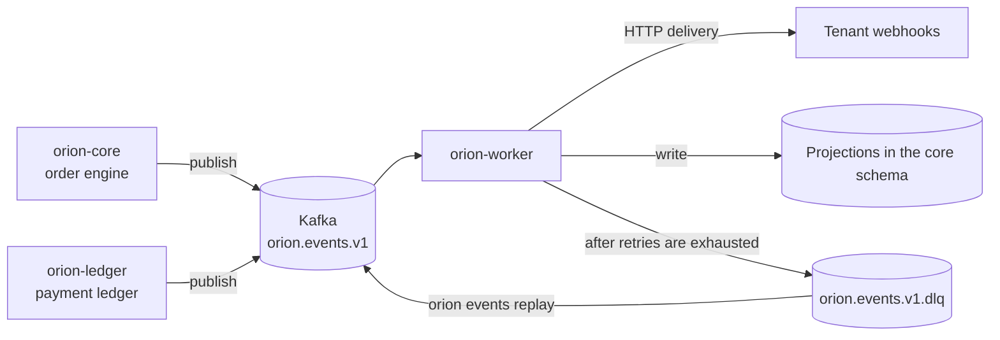

# Event processing

Every meaningful state change in Orion Platform publishes an event to the Kafka topic `orion.events.v1`. The consumer is `orion-worker`, which builds read projections and delivers webhooks to external systems. Events that could not be processed after retries are exhausted end up in `orion.events.v1.dlq`.

## Flow



## Delivery guarantees

Semantics
:   ==at-least-once==. The same event may be delivered more than once, for example after
    `orion-worker` restarts before the offset is committed. The consumer must be idempotent.

Ordering
:   Preserved only within a single partition. Events from different partitions may arrive
    in an order different from `occurred_at`.

Partitioning key
:   The order identifier (`ord_...`), and for customer events the customer identifier (`cus_...`).
    All events for one order land on the same partition, so `order.created`
    always precedes `order.paid`.

!!! warning "Do not assume global ordering"
    `payment.captured` for order A may be delivered before `order.created` for order B,
    even if B was created earlier. If your logic requires ordering across orders, rely
    on the `occurred_at` field, not on the order of receipt.

## Event envelope

All events share the same envelope; they differ in the contents of `data`.

```json title="order.paid"
{
  "id": "evt_01HQ8ZV3KXN4M2T9YB7C6D",
  "type": "order.paid",
  "version": "1",
  "occurred_at": "2026-02-11T09:41:07.482Z",
  "tenant": "ten_01HQ8ZV3KXN4M2T9YB7C6D",
  "request_id": "req_9f4kq2zt7mxb3nrv6hcd8s",
  "data": {
    "order_id": "ord_01HQ8ZV3KXN4M2T9YB7C6D",
    "customer_id": "cus_01HQ8ZV3KXN4M2T9YB7C6D",
    "payment_id": "pay_01HQ8ZV3KXN4M2T9YB7C6D",
    "status": "paid",
    "previous_status": "pending_payment",
    "total_minor": 24990,
    "currency": "PLN"
  }
}
```

| Field | Type | Description |
| --- | --- | --- |
| `id` | `string` | event identifier, the deduplication key |
| `type` | `string` | event type, for example `order.created`, `payment.refunded` |
| `version` | `string` | envelope schema version; always `1` in 4.2 LTS |
| `occurred_at` | `string` | event time in UTC with millisecond precision |
| `tenant` | `string` | tenant in whose context the event was produced |
| `request_id` | `string` | link to the HTTP request that triggered the change |
| `data` | `object` | payload that depends on `type` |

!!! tip "New fields are not a breaking change"
    Within 4.2 LTS, new fields may be added to the `data` object. A consumer should ignore
    unknown keys rather than reject the message.

## Subpages

| Page | Contents |
| --- | --- |
| [Queues and topics](queues.md) | topic configuration, consumer groups, DLQ, retention |
| [Retries and idempotency](retries.md) | retry policy, idempotency keys, circuit breaker |

## See also

- [Event types](../../api/webhooks/event-types.md)
- [Signature verification](../../api/webhooks/signature-verification.md)
- [Queue backlog](../../operations/runbooks/queue-backlog.md)
- [Architecture](../../introduction/architecture.md)
