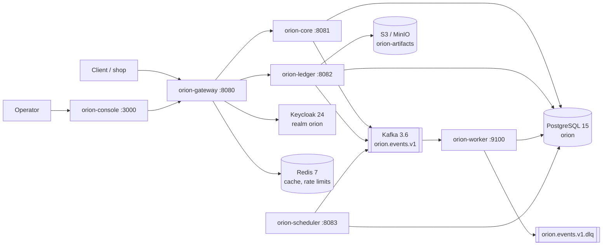

# Architecture

Orion Platform consists of six independently deployed components and five external dependencies. Synchronous traffic passes exclusively through `orion-gateway`, while communication between the order engine and asynchronous processes goes through Apache Kafka. The description below applies to release 4.2 LTS and is the same for every installation method.

## High-level diagram

## Components

| Component | Role | Port | Scaling mode | Statefulness |
| --- | --- | --- | --- | --- |
| `orion-gateway` | REST API, authentication, rate limits, idempotency | 8080 | horizontal, no replica limit | stateless (state in Redis) |
| `orion-core` | order engine, status transitions, domain validation | 8081 | horizontal, 3+ replicas recommended | stateless (state in PostgreSQL) |
| `orion-ledger` | payment and settlement ledger, exports | 8082 | horizontal, 2+ replicas recommended | stateless (state in PostgreSQL and S3) |
| `orion-worker` | Kafka event consumer, retries, DLQ | — (metrics on 9100) | horizontal up to the topic partition count | stateless (offsets in Kafka) |
| `orion-scheduler` | scheduled jobs: cart expiry, settlements, retention | 8083 | exactly 1 active replica (leader election) | stateless with a lock in PostgreSQL |
| `orion-console` | web panel for operators | 3000 | horizontal | stateless |

!!! warning "The scheduler does not scale horizontally"
    Increasing the number of `orion-scheduler` replicas does not increase throughput, because the extra replicas stay on standby and take over work only after the leader loses its lock. The replicas exist purely for availability.

## Request flow: creating an order

1. The client sends `POST /v1/orders` to `https://api.orion.example.com/v1` with a Bearer token and the `Idempotency-Key` header, plus an optional `X-Orion-Request-Id`.
2. `orion-gateway` verifies the token in Keycloak (realm `orion`) and checks that the `orders:write` scope is present; for an API key it validates the `X-Orion-Key` header.
3. The gateway reads the rate limit counter for the key from Redis and adds the `X-RateLimit-Limit`, `X-RateLimit-Remaining` and `X-RateLimit-Reset` headers to the response; if the limit is exceeded it returns `ORN-3001`.
4. The gateway checks in Redis whether the `Idempotency-Key` has already been used. If it has, it returns the stored response without calling `orion-core`; if the same key arrives with a different request body, it returns `ORN-4002`.
5. The request reaches `orion-core`, which validates the structure and the existence of the customer (`cus_...`) in the `core` schema; a validation failure ends with a code in the `ORN-1xxx` range.
6. `orion-core` writes the order with status `draft` into the `core` schema and a revision entry into the `audit` schema within a single database transaction.[^tx]
7. Once the transaction is committed, `orion-core` publishes an `order.created` event to the `orion.events.v1` topic, keyed by the order identifier (`ord_...`), which guarantees event ordering for a single order.
8. The order moves to status `pending_payment` and `orion-ledger` creates the associated payment record (`pay_...`) in the `ledger` schema.
9. The gateway returns `201 Created` with the order representation and an `X-Orion-Request-Id` header used to correlate logs.
10. `orion-worker` picks up `order.created`, builds the webhook delivery queue (`whk_...`) and sends the notifications; attempts that keep failing after the retries are exhausted end up in `orion.events.v1.dlq`.

## Data model

All components use a single PostgreSQL database named `orion`, split into three schemas with disjoint responsibilities.

`core`
:   Customers, carts, orders, order line items, status transition history. `orion-core` owns the migrations.

`ledger`
:   Payments, authorizations, captures, refunds, settlement statements. `orion-ledger` owns the migrations. Entries are append-only, so a correction is made through an offsetting entry.

`audit`
:   An immutable operation log: who, when, on behalf of which tenant and with which `X-Orion-Request-Id`. Entries are subject to a retention period set by the profile.

!!! note "One database, three schemas"
    Components never reach into their neighbours' schemas through SQL. `orion-core` does not read from `ledger` and `orion-ledger` does not read from `core`, because data is exchanged over REST or through events. As a result, splitting the schemas into separate databases requires no code changes.

## Architecture decisions

ADR-001: Kafka as the event bus
:   Apache Kafka 3.6 was adopted with a single domain topic `orion.events.v1` and keying by aggregate identifier. Rationale: durable retention allows consumer state to be rebuilt (`orion events replay`), and ordering within a key is guaranteed. Queues without retention were rejected because they made it impossible to reprocess history after a consumer bug.

ADR-002: Idempotency at the gateway level
:   Deduplication of write requests happens in `orion-gateway` based on the `Idempotency-Key` header, with the response stored in Redis for 24 hours. Rationale: a single control point for all resources and no need to repeat the logic in every component. Consequence: Redis is a critical dependency for write operations.

ADR-003: A separate payment ledger
:   Payments are handled by the dedicated `orion-ledger` component with its own schema and an append-only model, rather than by a module inside `orion-core`. Rationale: different audit and retention requirements, an independent release cycle and the ability to scale and harden the ledger without affecting the order engine.

??? info "Consistency boundaries"
    Immediate consistency (an ACID transaction) applies only within a single component and a single schema. Between `core` and `ledger` the guarantee is eventual consistency, so an order may briefly stay in `pending_payment` while the ledger has not yet confirmed the authorization. API clients must treat a state as final only after they receive the webhook event.

[^tx]: The event is published after the transaction is committed, based on an outbox table in the `core` schema. An event may be delivered more than once, so consumers must be idempotent with respect to `evt_...`.

## See also

- [What is Orion Platform](what-is-orion.md)
- [Glossary](glossary.md)
- [Event queues](../guides/events/queues.md)
- [Scaling](../operations/scaling.md)
