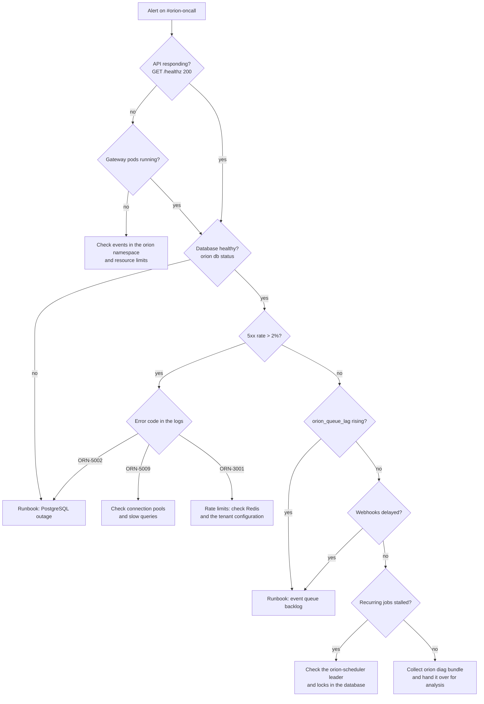

# Runbooks

Runbooks describe the proven response to incidents in Orion Platform 4.2 LTS. Every alert routed to the SRE on-call engineer has a runbook assigned in the `runbook_url` annotation. The documents follow a fixed schema so that nobody has to read them end to end during an incident.

## How to use a runbook

The sections always appear in the same order: `Symptoms`, `Impact and severity`, `Quick diagnosis`, `Procedure`, `Escalation`, `After the incident`, `Prevention`. During an event, go straight to "Quick diagnosis"; the commands are given together with their expected output, so any deviation is immediately visible. The "Procedure" step contains checkpoints; do not move on until a checkpoint is satisfied.

## Triage decision tree



## Runbook catalogue

| Alert | Symptom | Severity | Runbook |
| --- | --- | --- | --- |
| `OrionDbPoolSaturated`, `OrionDbReplicationLag`, `OrionDiskFilling` | `ORN-5002` errors, rising `orion_db_pool_waiting`, red `/readyz` | P1 | [PostgreSQL outage](database-outage.md) |
| `OrionQueueLagHigh`, `OrionDlqGrowing`, `OrionWebhookFailures` | `orion_queue_lag` > 1000, delayed webhooks, growing DLQ | P2 | [event queue backlog](queue-backlog.md) |
| `OrionApiDown` | No healthy `orion-gateway` replicas | P1 | Triage above, then the matching runbook |
| `OrionHighErrorRate` | 5xx share above 2% | P1 | Triage by error code |
| `OrionLatencyBudgetBurn` | p95 for `GET` above 250 ms | P2 | [scaling](../scaling.md) |
| `OrionSchedulerStalled` | No successful job run for over an hour | P2 | Triage: recurring jobs branch |
| `OrionCertExpiring` | Certificate expires within 14 days | P3 | [security](../security.md) |
| `OrionRateLimitSpike` | Increase in `ORN-3001` responses | P3 | [rate limits](../../api/rest/rate-limits.md) |

## Running an incident

Incident commander (IC)
:   The first person to acknowledge the alert, until responsibility is formally handed over. Makes decisions and does not perform diagnostics personally during P1 incidents.

Operator
:   Runs the commands from the runbook and reports the results to the commander. At P1, at least two people: an operator and a verifier.

Communications
:   The person running the `#orion-oncall` channel and updating `https://status.orion.example.com`. At P1, an update every 30 minutes, even when there is no progress.

Timeline
:   Kept in the incident thread from the first minute: UTC time, action taken, observed effect. The timeline is the basis for the postmortem and is not reconstructed from memory after the event.

## Severity and response times

| Severity | Criterion | Response time | Channel |
| --- | --- | --- | --- |
| P1 | Complete API unavailability or data loss | 30 min | PagerDuty + `#orion-oncall` |
| P2 | Service degradation, SLO breach without a full outage | 4 h | `#orion-oncall` |
| P3 | Single feature broken, workaround available | 1 business day | email, support portal |
| P4 | Question, minor cosmetic issue | 3 business days | support portal |

## `#orion-oncall` post template

```text
[P1] OrionDbPoolSaturated — orion-core, prod
Start: 2026-02-11T09:12Z   IC: marek.debski   Operator: —
Symptom: 503 ORN-5002 on POST /orders, orion_db_pool_waiting=41
Impact: all tenants, order creation unavailable, reads working
Hypothesis: connection leak after the 4.2.1 rollout in orion-ledger
Action: gateway switched to read-only, rolling restart of orion-ledger
Runbook: https://docs.orion.example.com/operations/runbooks/database-outage/
Status: https://status.orion.example.com — updated 09:18Z
Next update: 09:45Z
```

Add updates in the thread using the format `HH:MMZ — action — effect`. The closing post contains the time service was restored, confirmation of an empty DLQ and the date of the postmortem.

!!! warning "Do not change two things at once"
    At P1, make one change at a time and wait for confirmation in the metrics (usually 2 to 3 scrape intervals, so up to 90 s). Parallel changes make it impossible to establish the cause and complicate rollback.

## See also

- [Runbook: PostgreSQL outage](database-outage.md)
- [Runbook: event queue backlog](queue-backlog.md)
- [Alerts](../monitoring/alerts.md)
- [Operations](../index.md)
- [Support](../../support.md)
